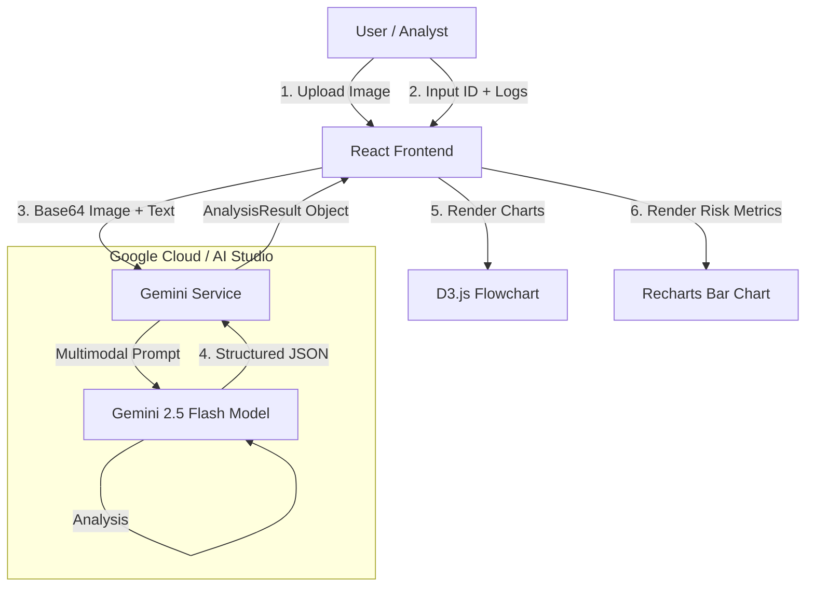

# Cross-Border Transaction Debugger 🕵️‍♂️💸

## Overview
The **Cross-Border Transaction Debugger** is a forensic tool designed for Fintech developers and support analysts (specifically modeled after Xoom/PayPal workflows). It significantly reduces the Mean Time To Resolution (MTTR) for failed international money transfers.

Unlike traditional log viewers, this application uses **Multimodal AI (Gemini 2.5 Flash)** to understand the *intent* of a transaction by looking at a flow diagram and comparing it against the *reality* of fragmented server logs.

---

## 🚀 How to Use the Application

### 1. Preparation
You need three pieces of information to debug a transaction:
*   **The "Ideal" Path:** An image of the payment flow diagram (e.g., a flowchart showing Gateway -> Compliance -> FX -> Payout).
*   **The Target:** The specific Transaction ID (e.g., `XOOM_98765`).
*   **The Evidence:** Raw, messy logs from your microservices.

### 2. Step-by-Step Workflow

1.  **Upload Flow Diagram:**
    *   Click the upload box in the top-left section.
    *   Select a PNG/JPG image of your system architecture or payment flow.
    *   *Why?* The AI uses this to "see" the expected order of operations (e.g., "The FX step must happen before the Payout step").

2.  **Enter Transfer ID:**
    *   Input the specific ID you are hunting for (e.g., `XOOM_98765`).
    *   *Why?* The AI acts as a filter, ignoring log lines that don't belong to this specific trace context.

3.  **Paste Logs (or Load Mock Data):**
    *   Paste your server logs into the text area.
    *   **Tip:** You can click "Load Mock Data" to instantly populate the fields with a sample failed scenario (SWIFT validation failure) for testing.

4.  **Run Analysis:**
    *   Click the **"Debug Transfer"** button.
    *   The system will process the inputs (Image + Text) and generate a forensic report.

### 3. Interpreting the Results

*   **Executive Summary:** A non-technical, one-sentence explanation of what went wrong.
*   **Cross-Modal Failure Trace:** This section correlates the visual diagram with the text logs. It tells you exactly *which box* in your diagram turned red and cites the specific log line responsible.
*   **Reconstructed Flow:** A visual node graph generated dynamically based on the AI's understanding of the logs.
    *   ✅ Green: Success
    *   ❌ Red: Failed
    *   ⚠️ Yellow: Pending/Warning
*   **Java Fix:** A concrete, code-level recommendation for the developer (e.g., "Update regex in `SwiftConnector.java`").

---

## 🏗️ Architecture & Technical Design

### High-Level Data Flow



### Component Breakdown

1.  **Frontend (React 19 + TypeScript):**
    *   **`App.tsx`**: The main controller. Manages state for logs, images, and the resulting analysis.
    *   **`LogViewer.tsx`**: A specialized text viewer that parses raw logs, highlighting errors (Red) and warnings (Yellow) using simple regex matching.
    *   **`TransactionFlow.tsx`**: Uses **D3.js** to render a Scalable Vector Graphic (SVG) flowchart. It visualizes the `steps` array returned by the AI.

2.  **AI Layer (`geminiService.ts`):**
    *   **Model:** `gemini-2.5-flash`.
    *   **Reasoning:** This specific model is chosen for its high speed and "Flash" multimodal capabilities, allowing it to process the image and heavy text logs simultaneously.
    *   **Prompt Engineering:** The prompt uses a "Persona" pattern ("You are a Senior Transaction Debugging Analyst").
    *   **Structured Output:** We force the AI to return `JSON` using the `responseSchema` configuration. This ensures the frontend never breaks due to hallucinated formats.

### Data Structures

The core interface driving the UI is `AnalysisResult` in `types.ts`:

```typescript
interface AnalysisResult {
  steps: TransactionStep[];        // Drives the D3 Flowchart
  executiveSummary: string;        // The "Manager" view
  failureTrace: string;            // The "Analyst" view
  technicalRecommendation: string; // The "Developer" view
  riskScore: number;               // Drives the Risk Chart
}
```

---

## 🔮 Future Enhancement Guide

If you plan to extend this application, here are the recommended areas based on the current architecture:

1.  **Live Log Streaming:**
    *   *Current:* Static text paste.
    *   *Upgrade:* Implement the Gemini **Live API** (WebSockets) to stream logs in real-time and have the AI update the D3 graph dynamically as steps complete.

2.  **Knowledge Base Integration (RAG):**
    *   *Current:* AI relies on its internal training data for "Java Fixes."
    *   *Upgrade:* Inject a "Context" part into the prompt containing your company's specific error codes or documentation (`context: specific_error_codes.pdf`). This allows the AI to suggest fixes based on *your* internal wiki.

3.  **Compliance Scanning:**
    *   The `riskScore` is currently generated based on log sentiment.
    *   *Upgrade:* Add a specific tool definition for `checkSanctionsList(name)` so the AI can actually verify if a user in the logs is on a watchlist during the debugging process.
